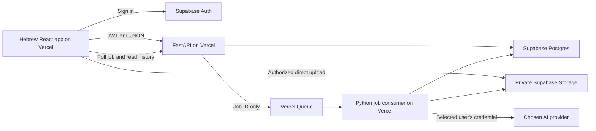

# Real-Estate Appraisal Assistant: web-app migration plan

Planning baseline: 19 September 2026. This document is a proposed implementation specification. No migration, cloud resources, repository commits, or deployments were performed while preparing it.

Reading guide: start with decisions and the code audit (1–3), then architecture and implementation contracts (4–12). Setup and plugin runbooks are in 13–16; the ordered work backlog is in 17; testing, operations, and launch gates are in 18–22.

Quick navigation: [architecture](#4-architecture-and-request-flow) · [Supabase schema](#6-supabase-schema-specification) · [file deletion](#8-uploads-direct-to-provider-alternatives-and-deletion) · [API](#10-api-contract) · [GitHub](#14-github-plugin-workflow-and-continuous-integration) · [Vercel](#16-vercel-plugin-deployment-runbook) · [implementation tickets](#17-implementation-tickets-sequence-and-estimates) · [launch checklist](#20-pilot-cutover-and-legacy-data).

## 1. Outcome and decisions

Deliver a Hebrew, right-to-left web application for an invited private team. Every member signs in individually, supplies their own AI API keys, creates an environment-description draft, reviews and edits it, and retrieves their saved work later.

The user has confirmed:

- Private team access with individual logins.
- Each user supplies their own AI provider keys.
- Saved appraisal history is shared with the whole team; provider keys remain private to their owner.
- Uploaded source files are temporary and must be deleted after use, with cleanup for failed or abandoned work.
- GitHub is the source repository, using the GitHub plugin for repository work.
- Vercel hosts the web application, using the Vercel plugin for deployment work.
- Supabase stores application data and history, using the Supabase plugin for database work.
- The current deliverable is a plan only.

Recommended implementation decisions:

| Area | Decision | Reason |
|---|---|---|
| Browser application | React + TypeScript + Vite; React Router | The product is an authenticated form/editor. It does not need server rendering or search-engine indexing. |
| Backend | Python + FastAPI, hosted on Vercel | Preserve the existing Python agents, prompt, and file libraries. |
| Deployment layout | One GitHub repository; separate Vercel frontend/backend project pairs for staging and production (four projects) | Independent builds; staging has its own real scheduler and isolated secrets. |
| Identity | Supabase Auth; invited email users; email OTP sign-in | Individual access without building password management. |
| Persistence | Supabase Postgres | Durable requests, results, revisions, approval records, settings, and job state. |
| Files | Private Supabase Storage bucket | Browser uploads bypass Vercel request-size limits. |
| Background generation | Vercel Queues with a Python consumer, behind an application interface | Jobs persist beyond browser connections; consumers run on Vercel. A beta feasibility gate is mandatory. |
| Credential storage | Encrypt each user's provider keys before storing them in an unexposed database schema | Replaces Windows Credential Manager without placing secrets in the browser. |
| History access | All active members of the same workspace can read saved history | Confirmed team-sharing requirement. Author alone edits/approves in version 1. |
| File retention | Temporary uploads only; delete after processing | Keep text history and minimal file metadata, not a permanent file library. |
| First-release scale | Planning assumption: 2–20 users, at most 5 concurrent generations per workspace | A concrete initial load target, adjustable after measurement. |

**History-access decision:** All active workspace members can read submitted requests, results, warnings, revisions, approval state, and minimal attachment metadata. Pending uploads and raw source files are accessible only to their uploader and the processing backend, then deleted. Provider settings/keys remain owner-only. Only an author can edit/approve their output; administrators can remove workspace history for retention/support with an audit event. Another member can duplicate text inputs into a new job using their own credential and newly uploaded files. The interface must explain that submitted text and generated history are shared with the team. Infrastructure administrators can access infrastructure; this is not end-to-end encryption.

**Why not rewrite everything in TypeScript?** That would replace five provider adapters and Python document extraction while changing the UI, storage, and deployment simultaneously. Reuse the Python implementation and improve its interfaces first. Next.js remains a reasonable future choice if server rendering becomes necessary; it is not required for this migration.

## 2. Verified starting point

Inspection covered the local source tree, dependency manifest, README, project brief, agent adapters, UI behavior, credential store, extractor, and tests.

| Current component | Observed implementation | Migration consequence |
|---|---|---|
| Startup | `src/appraisal_assistant/main.py` creates a PySide6 application and `MainWindow` | Replace the presentation layer; do not run Qt on Vercel. |
| Domain | `domain/models.py` has frozen dataclasses for `Attachment`, `SectionRequest`, and `AgentResult` | Retain domain concepts; expose separate validated API schemas. |
| Sections | `domain/sections.py` enables only `environment_description`; five other sections are disabled | Preserve this scope and enforce it on the server. |
| Provider routing | `application/agent_router.py` discovers configured providers through runtime settings | Replace process-wide desktop configuration with request-scoped user configuration. |
| Providers | OpenAI, Gemini, Anthropic, Moonshot, and Qwen adapters exist | Preserve all five options subject to actual provider/account capability tests. |
| Prompt | `agents/prompts/environment_description.md` loaded by its neighboring Python module | Package the Markdown file in the deployed wheel; record its hash with each run. |
| Attachments | `Attachment.path` is a local `Path` | Browsers submit uploaded attachment IDs, never operating-system paths. |
| File formats | UI lists PDF, DOC, DOCX, XLS, XLSX, CSV, TXT, and Markdown | Introduce explicit production support rules; DOC handling is currently a heuristic. |
| Generation | `MainWindow._generate()` invokes the router synchronously | Replace with persistent job submission, processing, and status polling. |
| History | `_output_history` is an in-memory list of address/output pairs | There is no existing durable history database to migrate. |
| Editing | Output is editable; original history entries do not track later edits | Store the original generated result separately from saved revisions. |
| Copy | `ui/output_tools.py` strips a leading Hebrew model header | Extract the pure helper from its Qt-importing module; keep model metadata outside report text in the web UI. |
| Keys/settings | `infrastructure/provider_settings.py` uses OS keyring, then environment fallback | Cloud settings must never fall back to another user's or the server operator's key. |
| Dependencies | `pyproject.toml` installs PySide6 and keyring with backend libraries | Move desktop dependencies into an optional extra; pin tested server dependencies. |
| Tests | 14 test functions across 11 test files; several use fake provider clients | Valuable regression starting point, not proof that the real services work. |

Important discrepancies to resolve deliberately:

1. The README contains older placeholder-only descriptions alongside real-provider instructions. Update it after implementation.
2. README says an example is required; the actual `_generate()` method only requires an address. Preserve **address required, example optional** for migration parity. Warn when no example is supplied; do not silently introduce a new requirement.
3. The brief describes address normalization, public-source retrieval, evidence verification, and explicit approval. The inspected code does not implement that retrieval pipeline or an approval gate.
4. Provider model menus contain unverified IDs. A menu entry does not demonstrate availability for an API account. Validate before offering a preset as supported.
5. OpenAI/Gemini/Anthropic check an attachment's size against 20 MiB. Moonshot/Qwen extraction lacks equivalent overall limits. No shared upload/token budget exists.
6. DOCX extraction currently reads paragraphs but omits tables; PDF extraction has no OCR; XLSX reads cached formula values; legacy DOC decoding is unreliable.
7. Provider exceptions currently include raw underlying error text. Replace this with safe user-facing errors and redacted diagnostics.

Environment findings:

- The inspected folder has no `.git` directory; `git status` reported that it is not a repository. A GitHub search did not identify a target repository. The repository URL remains a setup input, not an inferred value.
- GitHub plugin authentication was verified. Supabase plugin project listing worked; no appraisal-specific Supabase project was identified. Do not reuse another application's database.
- Vercel was found in the plugin directory but was not connected at inspection time. Connection is an implementation prerequisite.
- Attempting the existing pytest suite failed before Python started because this environment denied launching `.venv/Scripts/python.exe`. **No passing baseline is claimed.** Phase 0 must establish one.

## 3. Scope and acceptance boundaries

### Required for version 1

- Hebrew RTL form with address, optional example text, optional additional request, and two distinct attachment groups.
- Existing section selector, with unavailable sections visibly disabled and rejected server-side.
- Provider selection, saved per-user model settings, default provider, key replacement/removal, and masked configured status.
- File picker and drag/drop; upload progress; removal; per-file failures; clear accepted-format and size guidance.
- Explicit notice naming the chosen AI provider and the material that will be sent when Generate is pressed.
- Durable generation jobs and results; resume status after reload/login; prevent duplicate submission.
- Editable output, warnings, separate model metadata, save status, revision history, and copy.
- Explicit appraiser approval of the saved revision before enabling the application's Copy action, as required by `PROJECT_BRIEF.md`.
- Searchable, paginated saved history; delete; a simple UTF-8 text/JSON export for portability.
- Account invitation, suspension, sign-out, retention cleanup, operational monitoring, backups, and documented recovery.

### Explicitly deferred

- Valuation calculations, comparable sales, legal/planning conclusions, other report sections.
- Full Word/PDF report generation, CRM/customer management, billing/subscriptions, public registration.
- Live collaborative editing, offline editing, native mobile applications, arbitrary website scraping.
- OCR and reliable legacy `.doc` conversion. The web application will ask for DOCX/PDF conversion instead.
- New address/geospatial/retrieval agents. Migrating the application does not make AI drafts grounded in verified live sources.

The launch UI must state that the draft is based on supplied material and requires verification. Record a structured `NO_VERIFIED_PUBLIC_RETRIEVAL` warning on each generation until an actual evidence pipeline exists. Update/version the prompt to avoid implying that the application has retrieved current public facts. Do not market factual-grounding capabilities that have not been built.

The approval control is a recorded review workflow, not technical protection against someone manually selecting/copying visible text. Editing an approved output creates an unapproved revision and disables the application Copy button until approval again.

## 4. Architecture and request flow



The browser never calls an AI provider directly. It holds a Supabase user session, not a provider credential after the settings form has been submitted. All application API routes use HTTPS.

Normal workflow:

1. User signs in and the backend verifies active workspace membership.
2. Browser loads section definitions, safe provider configuration summaries, and current drafts.
3. Browser requests an attachment reservation. Server allocates an immutable storage object name and upload authorization.
4. File bytes go directly to Supabase Storage. The backend finalizes and validates the uploaded object. No file bytes or base64 data pass through the public generation endpoint.
5. User clicks Generate. Backend validates input, ownership, attachment readiness, selected credential, allowed provider/model, quotas, and consent version.
6. In one database transaction, create a request snapshot, job, and outbox event. Return `202` with a job ID. Publishing is attempted immediately; an outbox reconciler repairs failed dispatches.
7. Queue consumer claims the job, rechecks access, downloads files into an isolated temporary directory, resolves only that user's credential, and calls the selected adapter.
8. Save result and initial revision atomically, queue source-file deletion, clear sensitive temporary files in `finally`, then acknowledge delivery. A separate cleanup process retries storage/provider deletions.
9. Browser polls status, displays the saved draft/warnings, and lets the author edit, save, approve, and copy.
10. Closing the tab does not cancel the job. Returning to History shows the job and result.

### Platform constraints that shape the design

Vercel supports FastAPI/Python deployment. Its documented standard Python function bundle limit is 500 MB; request/response payloads are limited to 4.5 MB. With Fluid Compute, ordinary Pro functions can be configured up to 800 seconds. Use a 300-second function ceiling and a shorter application deadline initially; no phase relies on extended-duration beta features. [FastAPI deployment](https://vercel.com/docs/frameworks/backend/fastapi), [function limits](https://vercel.com/docs/functions/limitations).

Vercel Queues and its Python SDK are documented as beta. Treat availability, consumer authentication, deployment isolation, and retry behavior as a **Phase 1 feasibility gate**. Keep queue transport behind `JobDispatcher` so it can be replaced without changing domain logic or the API. [Queues](https://vercel.com/docs/queues), [Python SDK](https://vercel.com/docs/queues/python-sdk).

Never rely on a global Python dictionary, local SQLite, files beside source code, a FastAPI background task after returning a response, or a continuously running thread for durable application state. Temporary files are disposable working copies only.

## 5. Proposed repository layout and code changes

Keep the existing Python package in place while adding the browser app and backend entrypoint. The following is a target layout, not files already created:

```text
real-estate-appraisal/
  app.py                         # FastAPI instance exposed to Vercel
  pyproject.toml                  # Core/server deps; optional desktop extra
  uv.lock                        # Locked Python dependency graph
  vercel.json                    # Python deployment/consumer/cron settings
  .vercelignore
  .env.example                   # Names and descriptions only
  src/appraisal_assistant/
    domain/                      # Existing models/sections + job enums
    application/
      agent_router.py            # Explicit request-scoped provider injection
      generation_service.py
      attachment_service.py
      revision_service.py
      ports.py                   # Repositories, credential resolver, dispatcher
    agents/                      # Existing adapters and packaged prompt
    services/
      file_text_extractor.py
      output_text.py             # Pure output normalization, no Qt imports
    infrastructure/
      database.py
      repositories/
      cloud_credentials.py
      storage.py
      queue_dispatcher.py
      provider_catalog.py
      ...existing desktop settings retained temporarily...
    api/
      auth.py
      schemas.py
      errors.py
      routes/                    # jobs, drafts, files, settings, team, health
    workers/
      generation.py
      reconcile.py
      cleanup.py
    ui/                          # Desktop UI retained during transition
  web/
    package.json
    package-lock.json
    vercel.json                  # SPA routing/security headers
    src/
      app/                       # Router, app shell, auth boundary
      features/auth/
      features/generation/
      features/history/
      features/settings/
      features/team/
      components/
      lib/api/                   # Generated types + typed HTTP client
      lib/supabase.ts
      styles/
    tests/
  supabase/
    config.toml
    migrations/                  # Versioned schema, grants, RLS, indexes
    tests/                       # SQL authorization/invariant tests
    seed.sql                     # Synthetic local data only
  tests/
    ...existing tests...
    unit/
    integration/
    contract/
  e2e/
  .github/workflows/
  docs/
    WEB_APP_MIGRATION_PLAN.md
    architecture-decisions/
    deployment-runbook.md
    recovery-runbook.md
```

Refactor in this order:

1. Freeze current behavior in fixtures/tests; copy the exact original prompt into the baseline commit.
2. Move PySide6/keyring to a `desktop` optional dependency group; core/server installs must not import or install Qt.
3. Split `ProviderDefinition`/catalog from `ProviderSettingsStore`. Cloud code must not import OS-keyring behavior.
4. Keep provider settings dataclasses, but construct them explicitly with one authenticated user's credential/model. Do not invoke `from_runtime()` in cloud request handling.
5. Add an explicit factory such as `AgentRouter.for_provider(provider_id, settings)`; avoid shared user-configured adapter instances and mutable SDK clients between requests.
6. Move `without_model_header()` into `services/output_text.py`. Update the desktop import without changing its behavior.
7. Keep `Attachment.path` as an internal adapter input for now: authorized cloud attachment -> temporary local file -> existing domain attachment. API DTOs contain IDs, not paths.
8. Return plain generated text and separate model/provider metadata in the cloud result mapper. Preserve the original provider response only as permitted by retention policy; do not strip arbitrary user-authored first lines.
9. Close workbooks/files/HTTP clients reliably; add extraction budgets and structured warnings.
10. Make provider timeout/retry/output limits explicit. Package the prompt resource and test loading it from an installed wheel on Linux.

Pin Python 3.13 as the initial compatibility target because the inspected environment was built with it; verify the selected Vercel runtime in Phase 1. Choose an actively supported Node LTS (proposed Node 24) and TypeScript 5+ at implementation, pin toolchain versions, and commit lockfiles. Supabase has announced removal of Node 20 support; do not build a new project around it. [Node support change](https://supabase.com/changelog/45715-deprecation-notice-dropping-support-for-node-js-20).

## 6. Supabase schema specification

Use UUID primary keys, `timestamptz` in UTC, `created_at`/`updated_at`, explicit foreign keys, and bounded text fields. Display timestamps in `Asia/Jerusalem`. Use SQL migrations; do not build production tables manually without recording the migration.

### Tables

| Table | Required fields beyond primary key/timestamps | Purpose and rules |
|---|---|---|
| `workspaces` | `name`, `status` | One initial firm/team; retain workspace isolation in the schema. |
| `workspace_members` | `workspace_id`, `user_id` -> `auth.users`, `role` (`admin/member`), `status` (`active/suspended`), `invited_by` | Unique `(workspace_id,user_id)`. Role changes only through verified admin operations. |
| `profiles` | `user_id` unique, `display_name`, `locale`, `default_provider` | Personal preferences. Email identity comes from Auth. |
| `provider_settings` | `user_id`, `provider_id`, `model_id`, `configured`, `key_last4`, `credential_version`, `last_verified_at` | Unique `(user_id,provider_id)`. No plaintext or ciphertext here. |
| `attachments` | `workspace_id`, `owner_id`, `object_key`, `original_name`, `suffix`, `detected_mime`, `size_bytes`, `sha256`, `status`, `expires_at`, `deleted_at`, `cleanup_attempts`, `validation_error_code` | Status: `reserved/uploaded/validating/ready/rejected/deleting/deleted`. Object key unique; validated files immutable; metadata survives source deletion. |
| `generation_jobs` | `workspace_id`, `owner_id`, `section_id`, `address`, `example_text`, `additional_request`, `provider_id`, `model_id`, `credential_version`, `prompt_hash`, `consent_version`, `consented_at`, `idempotency_key`, `request_hash`, `status`, `stage`, `attempt`, `lease_token`, `lease_expires_at`, `started_at`, `completed_at`, `error_code`, `warnings`, `output_text`, `provider_request_id`, `usage`, `app_commit_sha`, `job_schema_version`, `deleted_at` | Immutable input snapshot. Server controls status/result. Original `output_text` never overwritten by editing. |
| `job_attachments` | `job_id`, `attachment_id`, `group` (`example/additional_request`), `position`, `workspace_id`, `owner_id`, `original_name`, `suffix`, `size_bytes`, `sha256`, `source_deleted_at` | Immutable metadata snapshot; preserve group/order, validate matching owner/workspace. Team readers see metadata without raw upload rows/object keys. |
| `draft_revisions` | `job_id`, `workspace_id`, `owner_id`, `revision_number`, `text`, `text_sha256`, `created_by` | Append-only; unique `(job_id,revision_number)`. Initial revision 1 is the saved original. |
| `draft_approvals` | `job_id`, `revision_id`, `approved_by`, `approved_at`, `text_sha256` | Append-only. Approval covers exactly one revision/hash and is written only after server validation. |
| `audit_events` | `workspace_id`, `actor_id`, `event_type`, `resource_id`, `request_id`, `metadata` | Minimal operational audit, no full prompts/files/API keys. Application users cannot edit audit records. |
| `private.provider_credentials` | `user_id`, `provider_id`, `version`, `ciphertext`, `nonce`, `encryption_key_version`, `revoked_at` | Unexposed schema. Unique `(user_id,provider_id,version)`. Server-only encryption/decryption. |
| `private.task_outbox` | `resource_type`, `resource_id`, `event_type`, `generation`, `dispatch_state`, `attempt`, `next_attempt_at`, `dispatched_at`, `deployment_id` | Unique `(resource_type,resource_id,event_type,generation)`; events for job dispatch, attachment validation, and cleanup. Only server-created typed variants are accepted. |
| `private.cleanup_tasks` | `workspace_id`, `job_id` nullable, `attachment_id` nullable, `resource_kind`, `object_key` or `remote_file_id`, `provider_id` nullable, `credential_version` nullable, `status`, `attempt`, `next_attempt_at`, `last_error_code`, `completed_at` | Unique resource identity; deletion retry ledger. Store remote provider-upload IDs immediately after creation; no public access. Do not cascade-delete pending cleanup tasks with a job. |
| `private.usage_counters` | `workspace_id`, `user_id`, `window_start`, `window_kind`, `count`, `reserved_tokens` | Atomic rate/quota reservations. No browser writes. |

Additional lifecycle constraints: `job_attachments.attachment_id` is unique across jobs (a source upload is consumed once); `generation_jobs.rerun_of_job_id` is a nullable same-workspace FK; a saved revision is allocated while locking its parent job; approval checks the latest revision under the same lock. Enforce exactly one active attempt lease and one active quota reservation per job. Define outbox resource variants explicitly instead of accepting arbitrary table names.

Keep JSONB only for variable warning/usage/audit metadata; identity, ownership, status, and timestamps are typed columns. Each warning is `{code, message_he, attachment_id?}`. Exclude exception objects and arbitrary provider responses.

Required constraints/indexes:

- Nonblank address; valid provider/section/status/group; positive bounded file size; nonnegative revision/attempt counts.
- Unique `(owner_id,idempotency_key)` plus a request hash to distinguish a repeated request from a conflicting reuse of a key.
- Composite foreign keys or equivalent transaction checks ensure job attachments/revisions cannot connect records across owners/workspaces. Add matching composite unique parent keys when using composite FKs.
- History index `(workspace_id,created_at DESC,id DESC)` filtered to nondeleted rows, plus `(workspace_id,owner_id,created_at DESC,id DESC)` for author filtering; job dispatch index `(status,lease_expires_at)`; outbox `(dispatch_state,next_attempt_at)`.
- Index foreign-key lookup paths (`job_id`, `attachment_id`, `user_id`, `workspace_id`). No full unbounded result payload in the history-list query.
- Use keyset pagination on `(created_at,id)`, default 25/max 100. Address search initially uses a bounded case-insensitive match; add a measured trigram index if the seeded 10,000-row benchmark needs it.
- Never delete a user/job with a cascade that silently leaves storage objects behind. Coordinate a deletion job and preserve tombstones until cleanup succeeds.

### Database access strategy

For ordinary API reads, create a request-scoped Supabase client using the publishable key and the validated user's bearer token, so RLS applies. Do not mutate a global client's authorization header.

For server-controlled writes (job submission, results, revisions, approval, invites), use narrowly implemented repository methods with a server-only database connection or Supabase secret key. A privileged connection may bypass user RLS: every such method must explicitly constrain workspace, require ownership where applicable, check active membership, and enforce the allowed state transition. Shared reads do not imply permission to edit another member's work. Do not offer a generic table/query endpoint.

Atomic multi-table changes use a direct pooled Postgres transaction. Introduce a dedicated backend SQL role with only the needed table permissions, no DDL, and access to the `private` tables. Keep a separate migration-owner connection used only in deployment. Do not run the app as `postgres`. For a server-only role that is deliberately granted RLS access, document those policies separately from user policies. Keep transactions short and never hold one open during file downloads or AI requests. Use Supabase's transaction pooler for serverless runtime connections, with a small bounded client pool and a driver configuration compatible with transaction pooling.

### RLS and grants

Enable RLS on all exposed tables. Explicitly grant the required table privileges; exposure and RLS are separate controls, and new Supabase tables should not be assumed automatically accessible. [Data API exposure change](https://supabase.com/changelog/45329-breaking-change-tables-not-exposed-to-data-and-graphql-api-automatically).

- No application content access for `anon`; disable anonymous Auth accounts.
- `workspace_members`: users can read their own membership row. App administrators use a protected backend endpoint to list/manage team membership. This avoids recursive RLS policies querying the same table.
- `workspaces`: select only when an active own membership exists.
- `profiles` and `provider_settings`: owner-only select; server-controlled writes. An admin cannot read another member's provider configuration.
- Jobs/revisions/approvals: active membership in the row's workspace; revisions/approvals additionally join the permitted parent job and exclude deleted jobs. Ownership still controls editing/approval in the backend.
- Attachment reservation rows: owner-only. Team-visible history exposes a safe metadata projection through `job_attachments` (name, size, group, deleted status), never a live object key or download link. Do not expose other users' raw attachment rows through Data API reads.
- Revoke direct authenticated inserts/updates/deletes on state-controlled tables. Otherwise a user could directly mark a job succeeded or forge approval through Supabase's API.
- `audit_events`: no end-user direct access; separate redacted admin endpoint as needed.
- `private`: omit from exposed schemas; revoke schema/table permissions from `PUBLIC`, `anon`, and `authenticated`; grant only the backend role. Add RLS where appropriate for defense in depth.
- Any view exposed to users must use invoker security or be inaccessible to browser roles. Avoid security-definer functions unless specifically reviewed; never add one merely to bypass a policy error.

Example **read-only policy shape**, to adapt in a migration rather than copy as a complete schema:

```sql
create policy job_team_read on public.generation_jobs
for select to authenticated
using (
  deleted_at is null
  and exists (
    select 1 from public.workspace_members m
    where m.workspace_id = generation_jobs.workspace_id
      and m.user_id = (select auth.uid())
      and m.status = 'active'
  )
);
```

The membership table must first have its own nonrecursive self-read policy. Apply the same permitted-parent-job read condition to `job_attachments`; use its snapshot fields for shared file metadata. The example does not authorize inserts or updates. Test policies through actual user tokens, not exclusively through a service-role connection.

## 7. Authentication, team access, and credentials

### Sign-in and membership

1. Disable public signup and anonymous sign-in in Supabase Auth.
2. Bootstrap the initial workspace/admin once through a documented administrative operation. Never make the first arbitrary signup an admin.
3. Admin invites an email. Backend checks active admin role, reserves the membership invitation, and uses Supabase's administrative invitation operation. Make retries idempotent and handle email-send failures without duplicating users.
4. Use Supabase's supported invite callback to establish the first session; subsequent logins use email OTP with account creation disabled. Provide Hebrew OTP/email screens and expired-code/resend handling.
5. Configure real SMTP for production and verify delivery to the team's mail domains. Configure exact callback URLs for local, staging, and production. [Passwordless email](https://supabase.com/docs/guides/auth/auth-email-passwordless), [SMTP](https://supabase.com/docs/guides/auth/auth-smtp).
6. FastAPI validates JWT signature with Supabase's published signing keys, issuer, audience, expiry, and subject; reject tokens from another Supabase project. Use a maintained JWT library and bounded JWKS caching/refresh, not hand-written cryptography. [JWT guidance](https://supabase.com/docs/guides/auth/jwts).
7. Check membership in the database on every protected operation. Do not trust user-editable metadata for role/authorization. Suspension must block access even while an old JWT remains unexpired.
8. Revoking access also revokes refresh sessions, cancels queued jobs, and prevents new downloads. Consumer rechecks active membership immediately before sending content to a provider. Already dispatched requests cannot be recalled reliably.
9. Admin/key-management operations require recent authentication; require MFA for administrators before production. Never allow removal of the last active administrator.

The SPA may use the supported Supabase session persistence mechanism for login tokens. This is distinct from provider API keys, which must never be placed in localStorage/sessionStorage, analytics, URLs, or persisted form state. Clear query caches and sensitive UI state on sign-out. Render generated content as plain text, with a restrictive Content Security Policy, to reduce token theft through script injection.

### Bring-your-own-key lifecycle

- Settings form sends a key once over TLS to `PUT /v1/provider-settings/{provider}`. Clear the input after success and show only configured state and last four characters.
- GET never returns a saved key, even masked as a full-length secret. Key replacement and deletion are explicit actions; blank key on a model-only update means unchanged, not deleted.
- Encrypt using a maintained authenticated-encryption library (AES-256-GCM), a cryptographically random unique nonce, and additional authenticated data containing user ID/provider/version. Store ciphertext/nonce/key version in `private.provider_credentials`.
- Store the encryption master key only as a server secret in the backend Vercel project and in a separate controlled recovery store. It must not appear in Supabase rows, GitHub, frontend variables, build logs, or this document.
- Decrypt only for an authorized selected-provider request, keep it in memory briefly, and redact request headers and SDK error diagnostics.
- Cloud mode rejects missing credentials. Do not fall back to `OPENAI_API_KEY`, `GEMINI_API_KEY`, etc. supplied by a developer or another user.
- Save a credential version in each queued request. At execution, require that version to remain valid/current. Replacement/deletion invalidates queued work with a clear `CREDENTIAL_CHANGED` result; user explicitly reruns. Already in-flight calls may complete with the old credential.
- Rotate encryption keys by writing new records with the new version, retaining the old decrypt key temporarily, re-encrypting in bounded batches, checking all records, and removing the old key only after backup/restore compatibility is understood.
- “Test connection” makes a documented minimal provider request only after a user action, without appraisal material. Rate-limit it; explain that some providers may charge for a test call. A successful authentication check does not prove every file/model capability works.

Do not automatically export Windows Credential Manager data. Users re-enter keys in the web settings. Explain that the server must decrypt keys to call providers; this is encrypted storage, not a claim that the operator cannot access them.

## 8. Uploads, direct-to-provider alternatives, and deletion

### Answer to the direct-upload question

Browser-to-provider transfer is technically possible when a provider supports that particular browser endpoint and a suitable authorization mechanism. It is not established as a common secure solution for all five existing adapters. A JavaScript SDK alone does not establish browser-safe upload support. CORS rules, supported file types, authorization, and short-lived upload grants must all be verified per provider.

Ordinary provider API keys should remain server-side. OpenAI explicitly advises against exposing secret keys in client code; Anthropic's SDK disables browser support by default because of credential exposure. A future direct-upload optimization is acceptable only with provider-issued, tightly scoped short-lived upload credentials that do not disclose the stored API key, and demonstrated cleanup/ownership controls. Do not invent such a capability or assume an upload ID is a browser upload grant. [OpenAI authentication](https://developers.openai.com/api/reference/overview), [Anthropic SDK browser guidance](https://github.com/anthropics/anthropic-sdk-typescript).

**Chosen version-1 path:** browser -> temporary private Supabase Storage -> Vercel worker -> selected provider. Supabase is a short-lived upload buffer; Vercel uses memory and temporary disk only. Do not provision Vercel Blob or any permanent Vercel file store for this feature. The 4.5 MB public-request cap does not mean a worker cannot separately fetch a larger object and send an outbound provider request, subject to memory/time/provider limits.

### Upload protocol

1. Client validates extension/size for immediate feedback; server repeats all meaningful checks.
2. `POST /v1/attachments` reserves a row, checks quota, and allocates `workspace_id/user_id/attachment_uuid/source.ext`. Never put an address, customer name, or raw original filename in an object key.
3. Return one path-bound upload authorization, `upsert=false`, and its real expiry. Use the supported Supabase expiry rather than claiming an arbitrary expiry that its API cannot enforce.
4. Browser sends bytes directly to the private bucket. Use resumable TUS uploads for progress/retry and larger files; Supabase documents resumable uploads and signed-upload support. [Resumable uploads](https://supabase.com/docs/guides/storage/uploads/resumable-uploads).
5. `POST /v1/attachments/{id}/complete` verifies the reserved owner/path, actual size/type, upload completion, and expiration. Never trust the browser's claimed hash or MIME type. Queue bounded validation/extraction if it cannot complete promptly.
6. Server marks the file `ready` only when validation has succeeded. A generation can reference only ready files owned by its creator in the same workspace.
7. Once consumed by a job, the attachment cannot be changed, overwritten, or assigned to another new job. Double submissions with the same idempotency key still reference the same job.
8. Invalid uploads become `rejected` and are queued for immediate object deletion. Removing a file before submission also queues deletion; never retain a hidden copy.

Storage policies deny public reads and arbitrary writes. For signed-upload flows, authorization is checked before issuing the capability; bucket-level size/type limits and finalization checks still apply. A signed capability may remain usable until its actual expiry: cleanup must also find late uploads to expired/deleted reservations. End users have no UPDATE/upsert permission. Only the uploader may request an authenticated download while a file is pending; shared history never includes a working raw-file download.

### Initial application limits

These are proposed product limits, not claims about provider maximums. Expose the effective limit in the UI and configure them centrally.

| Limit | Initial value | Enforcement |
|---|---|---|
| File size | 20 MiB/file | UI, reservation, bucket, finalizer, worker |
| Attachment count | 5 files/job total across both groups | Submission transaction |
| Total original bytes | 40 MiB/job | Submission and actual downloaded bytes |
| Address | 1–500 characters after trim | API schema |
| Example/additional request | 20,000 characters each | UI and API |
| JSON request body | 256 KiB | Backend middleware before parsing |
| Extracted attachment text | 100,000 characters total, with model-specific token budget also enforced | Extraction/provider preparation |
| PDF pages | 100/file | Parser preflight |
| Spreadsheet cells | 50,000 nonempty cells/file | Bounded extraction |
| Office ZIP expansion | 100 MiB uncompressed/file, bounded entry count and compression ratio | Inspect archive metadata before extraction |
| Pending storage | 200 MiB/user; 2 GiB/workspace | Atomic reservations plus reconciled actual usage |

Base64 can expand binary payloads by roughly one third; some providers limit the aggregate encoded request. Enforce the lower of application and verified provider/model limits. Do not silently truncate documents or proceed after silently dropping an attachment; show the issue and require the user to remove/replace it or explicitly approve a documented partial-input mode.

### Format policy

| Type | Version-1 handling | Required cases |
|---|---|---|
| TXT/MD | Decode UTF-8/UTF-8-BOM, then CP1255 with an explicit encoding warning | Hebrew, mixed English, empty/corrupt files |
| CSV | Bounded parsed rows/columns, preserve headers and cell separation | Quoted cells, Hebrew encoding, oversized cells |
| DOCX | Paragraphs and table cells, preserve enough order/context | Tables, empty paragraphs, corrupt ZIP, no macros/external resource execution |
| XLSX | Worksheet names plus cell/row context; cached values only | Missing formula caches produce a warning; close workbook handles |
| XLS | Bounded extraction with worksheet/row labels | Invalid workbook, cell budget, date/number formatting |
| PDF | Native PDF only for a tested compatible provider/model; otherwise text extraction | Scanned/no-text and encrypted documents must be reported, never treated as successfully read |
| DOC | Reject with Hebrew instruction to convert to DOCX/PDF | Do not ship the existing byte-decoding heuristic as reliable conversion |

Never execute macros, spreadsheet formulas, external links, scripts, or document instructions. Do not convert untrusted documents using a heavyweight office process inside a public API request. Parser isolation, strict budgets, file-signature checks, and maintained dependencies are required; this does not amount to a claim of antivirus scanning. If the team needs malware scanning, evaluate and explicitly configure a scanning service before accepting arbitrary external files.

### Deletion contract

Implement deletion as a tracked workflow, not a single best-effort `finally` block:

1. When a job reaches `succeeded`, `failed`, `cancelled`, `needs_review`, or `expired`, insert cleanup work in the same transaction as the terminal state. Do not delete between automatic retry attempts while the job remains active.
2. Consumer immediately tries to delete Supabase objects and any explicit provider-upload objects created by the app. Source cleanup may not erase the saved generated text or revision history.
3. Delete temporary Vercel working files in `finally` after every attempt. A process kill can skip `finally`; temporary disk is never relied upon for retention, and each invocation uses unique paths and bounded disk/memory consumption.
4. A scheduled cleanup job runs every 15 minutes. Retry failed deletes with backoff, treat “already absent” as success, verify absence, and record `deleted_at` only after confirmation.
5. Remove abandoned reservations/uploads after 1 hour without a submitted job. Expire jobs after a maximum 30-minute total lifecycle; before expiring a running job, respect its bounded current execution lease and stop any new provider dispatch.
6. Set an absolute 24-hour source-object retention target as a safety net. Do not claim deletion during a storage/provider outage is guaranteed: alert if a source object exceeds the target, retry continuously, and pause new uploads if backlog/usage crosses the configured cap.
7. Reconcile bucket objects against attachment reservations daily, including objects uploaded after a reservation was expired/deleted. Storage deletion and reservation state must be idempotent.
8. Keep only minimal file metadata in history: name, type, size, hash, input group, and deletion timestamp. Delete temporary extracted text and any extraction caches too. Do not store a hidden full-text copy of each file in the history database.
9. UI shows “Source files deleted after processing; upload again to rerun.” Failed/manual retry creates a new job and requires reupload if the files have been deleted.
10. Do not back up the temporary source-file bucket or enable application-managed source-file versioning. Back up text history and schema instead.

If an adapter uses inline document bytes/text, there may be no separately addressable provider file to delete. If it uses a provider Files API, create a `private.cleanup_tasks` record with the job/provider/remote file ID/credential version immediately after upload and invoke that API's delete operation after processing. Never log provider file access URLs. Cleanup may become impossible with an externally revoked credential; alert the user to delete the remote object in that provider account, while still deleting our Supabase copy. Do not retain a user-deleted key indefinitely just to retry cleanup. Google documents its file lifecycle and deletion API, but that does not establish identical behavior for other providers. [Gemini Files API](https://ai.google.dev/gemini-api/docs/files).

Deleting our copy or a provider file object does **not** guarantee erasure of provider-side request logs, abuse-monitoring data, or backups. Record verified retention settings per provider and communicate that separate boundary accurately. Prefer bounded inline/text submission in version 1 where compatible, so remote uploaded objects and cleanup credentials are unnecessary.

## 9. Provider behavior and compatibility

Preserve the adapter interface and prompt intent, but verify the real integrations. Do not assume all supported upload extensions can be sent as native files to every API.

| Provider | Inspected transport | Migration work |
|---|---|---|
| OpenAI | Responses API, native `input_file` parts, `store=False` | Keep server credentials and explicit storage setting; verify chosen model/file support and aggregate budgets. |
| Gemini | `client.interactions.create`, inline document content, reads `output_text` | Confirm SDK/API schema and output parsing with the pinned SDK; do not assume a mocked test proves this call is supported. |
| Anthropic | Messages API, PDF as document, other formats extracted to text; 1,000 output tokens | Verify native PDF rules, configurable output budget, and response block parsing. |
| Moonshot | OpenAI-compatible chat completions, extracted file text | Apply common file/token limits and preserve sheet/document structure. |
| Qwen | OpenAI-compatible chat completions at the configured international endpoint | Verify account region/endpoint and selected model; apply common limits. |

Create a versioned `provider_catalog` containing provider ID, label, supported transport, tested model presets, configurable model field, input/output budget, timeout, supported modalities, and verified date. The server owns endpoint allowlists; a user may supply a model ID but never an arbitrary provider base URL. This prevents requests to internal infrastructure through configurable URLs.

For every supported provider before launch:

1. Verify official SDK methods against the installed/pinned version.
2. Run one tiny live text request with a test account whose owner authorized the call.
3. Run synthetic Hebrew text/PDF/DOCX/spreadsheet fixtures through the actual chosen file path.
4. Test invalid/revoked key, unavailable model, quota/429, empty response, timeout, refusal, and malformed output.
5. Record evidence in `docs/provider-compatibility.md`: exact model ID, SDK version, endpoint region, formats, limits, date, test result. Never store the test key there.
6. Disable an unverified preset or unsupported file route with a clear explanation. The five providers remain the target; a missing integration is an explicit incomplete feature, not a silent fallback to a different provider.

No automatic cross-provider fallback: it could transmit documents to a service the user did not select. Keep placeholder generation available only in local/test mode. It must not silently replace a failed real call or appear as a successful professional result.

## 10. API contract

Use `/v1` versioned endpoints, Pydantic validation, OpenAPI-generated TypeScript types, and a small typed client. The client may hide unavailable buttons, but the server enforces every rule.

| Method/path | Behavior | Authorization |
|---|---|---|
| `GET /health/live` | Process alive; no secrets/dependency details | Public, minimal response |
| `GET /health/ready` | Database/config readiness, safe status only | Internal monitor/admin |
| `GET /v1/me` | User profile, workspace membership/role | Active user |
| `GET /v1/catalog` | Sections, tested provider presets, effective limits | Active user |
| `GET /v1/provider-settings` | Own safe summaries, default provider | Owner |
| `PUT /v1/provider-settings/{provider}` | Create/replace key or update model | Owner, recent auth |
| `DELETE /v1/provider-settings/{provider}/credential` | Revoke/remove key | Owner, recent auth |
| `POST /v1/provider-settings/{provider}/test` | Explicit minimal test | Owner, rate-limited |
| `PATCH /v1/me/preferences` | Default provider/display preferences | Owner |
| `POST /v1/attachments` | Reserve upload and return upload instructions | Active user, quota available |
| `POST /v1/attachments/{id}/complete` | Verify upload, begin validation | Uploader |
| `GET /v1/attachments/{id}` | Safe validation/status summary | Uploader |
| `DELETE /v1/attachments/{id}` | Delete unconsumed upload | Uploader; consumed files follow cleanup |
| `POST /v1/jobs` | Validate immutable inputs and enqueue; returns 202 | Active creator; own key/files |
| `GET /v1/jobs` | Team history summary; filters and cursor | Active member of workspace |
| `GET /v1/jobs/{id}` | Detail/status/result/metadata | Active member of same workspace |
| `POST /v1/jobs/{id}/cancel` | Cancel if queued; request cancellation if running | Author or workspace admin |
| `POST /v1/jobs/{id}/revisions` | Save edited text with expected revision | Author |
| `GET /v1/jobs/{id}/revisions` | Immutable revision history | Active teammate |
| `POST /v1/jobs/{id}/approvals` | Approve exact current saved revision | Author, explicit user action |
| `GET /v1/jobs/{id}/copy-text?revision=...` | Return approved text, no model header | Active teammate; requested revision must be current and approved |
| `GET /v1/jobs/{id}/export` | Text/JSON data export, with review status | Active teammate; distinguish draft export from approved report text |
| `DELETE /v1/jobs/{id}` | Tombstone immediately; delete data via cleanup | Author or admin; audit |
| `GET/POST /v1/team/members` | List members / invite | Admin |
| `PATCH /v1/team/members/{id}` | Suspend/reactivate/change role | Admin, recent auth; preserve last admin |
| Internal queue callback | Validate queue origin and process referenced job | Queue SDK/platform authentication only |
| Internal reconcile/cleanup routes | Bounded scheduled processing | Vercel cron authentication; no browser access |

Example submission, with `Authorization: Bearer <supabase-access-token>` and an `Idempotency-Key` UUID header:

```json
{
  "workspace_id": "<workspace-uuid>",
  "section_id": "environment_description",
  "address": "רחוב לדוגמה 2, חדרה",
  "example": "דוגמת סגנון שסופקה על ידי המשתמש",
  "additional_request": "תיאור תמציתי",
  "provider_id": "openai",
  "model_id": "<validated-model-id>",
  "example_attachment_ids": ["<attachment-uuid>"],
  "additional_request_attachment_ids": [],
  "consent_version": "provider-transmission-v1"
}
```

Server derives `owner_id` from verified authentication; checks workspace membership; resolves the key and version; computes a canonical input hash including attachment hashes/groups, provider/model, and prompt version. Do not accept arbitrary owner, credential, object-key, status, or output fields.

```json
{
  "job_id": "<job-uuid>",
  "status": "queued",
  "status_url": "/v1/jobs/<job-uuid>",
  "request_id": "<trace-uuid>"
}
```

One safe error envelope:

```json
{
  "error": {
    "code": "ATTACHMENT_NOT_READY",
    "message_he": "יש להמתין לסיום בדיקת הקבצים לפני יצירה.",
    "retryable": false,
    "request_id": "<trace-uuid>",
    "field": "example_attachment_ids"
  }
}
```

Status codes: `401` invalid/expired login; `403` inactive/member lacks permission; `404` absent or inaccessible resource (do not disclose another workspace's IDs); `409` edit/idempotency/state conflict; `413` payload too large; `422` field/file/model validation; `429` local quota with Retry-After; `503` temporarily unavailable dependency. Generation failures after `202` are stored as job state/errors, not retroactively represented as a failed submission.

Use `Cache-Control: no-store` for personalized API responses. Configure exact allowed browser origins, methods, and headers (`Authorization`, `Content-Type`, `Idempotency-Key`, revision preconditions). Do not use wildcard `*.vercel.app` CORS. These endpoints use explicit bearer headers, not automatically attached authentication cookies; CORS is not a substitute for authentication. If moving to cookie auth later, add a deliberate CSRF strategy.

## 11. Durable jobs and failure handling

### State machine

```text
queued -> running -> succeeded
   |         |----> retry_wait -> queued
   |         |----> failed
   |         |----> needs_review
   |         |----> cancel_requested -> cancelled
   |----> cancelled
   |----> expired
```

`stage` separately records `validating`, `extracting`, `calling_provider`, or `saving`. `needs_review` means an ambiguous provider outcome, not professional approval of a draft. Terminal states are immutable except explicit administrative repair recorded in the audit trail.

### Execution algorithm

1. Transactionally create the job and outbox row, reserve quotas, commit. Same idempotency key + same hash returns the existing job; same key + changed inputs returns 409.
2. Publish only `{job_id, job_schema_version, environment}`. Never place keys, full prompts, documents, or signed URLs in a queue message.
3. An outbox reconciler every minute republishes undispatched work with a stable delivery idempotency key; a publish timeout is treated as possibly published. Duplicate delivery is expected.
4. Consumer validates platform/queue authentication with the supported SDK path. Request headers with a recognizable name are not authentication. Configure one consumer group for generation so a message is not intentionally fanned out into duplicate model calls.
5. Atomically claim a permitted job using a conditional update or row lock and a unique fencing token. Check status, due time, workspace/member status, credential version, file readiness, deadline, and concurrency reservation.
6. Download/prepare files outside the database transaction; extend queue/DB leases through the supported mechanism if required. Each result write must match the current lease token, so an old worker cannot overwrite a newer result.
7. Record an attempt marker immediately before contacting the provider. Set explicit SDK timeout and disable/restrict hidden SDK automatic retries that would multiply the application retry policy.
8. Persist output, warnings, model/provider IDs, prompt hash, token usage when supplied, initial revision, completion, quota release, and cleanup event in one transaction.
9. Acknowledge delivery after persistence. If acknowledgment is lost, the next consumer sees the completed job and returns without another AI call.

### Timeouts and retries

- Initial function ceiling: 300 seconds; worker application deadline: 240 seconds; provider call timeout: 150 seconds; remaining time reserved for bounded parsing/storage and final persistence. Benchmark the worst accepted file bundle in Phase 1.
- Maximum 3 application attempts, with bounded backoff/jitter, within a total 30-minute job lifecycle. Only retry known transient failures where safe: explicit provider 429/retryable pre-processing errors, queue dispatch, or pre-call storage/network errors. Respect Retry-After and available lifecycle time.
- A timeout/disconnect/process death **after** a provider request may mean that the provider processed and charged for it. If the API offers a supported idempotency/retrieval mechanism, use it. Otherwise mark `needs_review`; do not automatically make another billable call.
- No claim of exactly-once external side effects. Local idempotency prevents duplicate submission/results; it cannot universally prevent duplicate charges after an ambiguous provider response.
- User-requested rerun creates a new job linked through `rerun_of_job_id` (add this nullable FK), confirms possible additional cost, and requires source files again if already deleted.
- Queued cancellation prevents dispatch. Running cancellation stops further steps and withholds result publication when possible; a provider already processing may finish and charge. Preserve this distinction in the UI.
- Reconciler detects expired leases, stalled outbox rows, orphan reservations, expired jobs, and completed jobs missing cleanup. Pre-call stalled work may requeue; post-call ambiguous work becomes `needs_review`.
- Queue failure/expiry must leave a visible actionable job state. Do not allow a spinner that lasts forever.

Vercel deployment partitions and SDK delivery leases must be exercised in Phase 1 with an actual redeploy. Record the enqueue deployment and job schema version, use separate environment topics, and recover abandoned outbox/jobs into the current compatible deployment through the database reconciler. Do not enable unrestricted cross-deployment consumption that could mix preview and production. The SDK documents deployment targeting and typed consumers; pin the tested version. [Python queue reference](https://vercel.com/docs/queues/python-sdk).

**Beta fallback decision:** If the queue test fails or the owner declines reliance on the beta service, stop that work item and choose a documented alternative before building the UI around it. Recommended fallback is a managed authenticated HTTP task-delivery service (for example QStash) invoking the same bounded Vercel worker, with the same outbox, claim, deadline, deduplication, and cleanup contracts. That adds a service/account/cost and requires verifying its current timeout, authentication, and retry contract. Do not quietly replace it with in-process background tasks. A confirmed transport is a prerequisite for production, not a deferred TODO.

## 12. Browser UX and Hebrew behavior

Routes:

- `/login`: email OTP, resend/expired-code handling, privacy explanation.
- `/auth/callback`: invitation/session flow, validated return path.
- `/new`: current structured generation form and two attachment groups.
- `/history`: shared team list with author/address/date/provider/status filters.
- `/history/:jobId`: status, immutable request summary, draft editor/read view, warnings, revisions, approval/copy/export.
- `/settings/providers`: own provider keys/models/default provider.
- `/team`: admin membership controls.

Use `<html lang="he" dir="rtl">`, CSS logical properties, and explicit LTR isolation for model IDs, filenames where needed, email addresses, numbers, and code. Preserve Unicode; do not reverse Hebrew strings manually. Render output as plain text with line breaks, not executable HTML. Do not use unsanitized Markdown rendering for provider output.

Required interactions:

1. Keep the form-driven workflow; do not introduce a chat interface.
2. Address required; optional example/additional text; labeled attachment sections. Prevent dropping a file into the wrong group silently.
3. File chips show name, size, upload/validation state, and remove. Include keyboard-accessible file picking; drag/drop is an enhancement.
4. Disable Generate until files are ready, a provider/model is configured, and input is valid. Backend remains authoritative.
5. The button and nearby notice clearly identify the selected provider, team visibility of history, and temporary source-file retention. Submission records notice version/time.
6. During execution show stage labels rather than invented percentage completion; allow navigation away and reopening the job.
7. Poll every 2 seconds initially, then back off to 5–10 seconds. Pause frequent polling in hidden tabs; fetch current state when visible. Stop on terminal states. Refresh an expired session once without duplicating POST operations.
8. Save editor changes after a short debounce (for example 1 second) and on explicit Save. Show `unsaved/saving/saved/error` and warn on navigation with unsaved edits. Keep unsaved content in memory, not browser persistent storage by default.
9. Save with `expected_revision_number`; return 409 on concurrent edit. Offer reload/copy-your-unsaved-text rather than overwriting another tab silently. Save only if the text actually changed.
10. Approval submits the exact saved revision/hash and is rejected if a newer revision exists. Copy retrieves only approved current text and invokes Clipboard API from a user action; display a selectable-text fallback if clipboard permission fails.
11. Teammates see read-only content and can copy an approved current revision or duplicate text inputs into their own new request. Their own keys are used on new work. Existing deleted attachment sources cannot be reused.
12. Handle offline state, login expiry, rate limit, provider failure, duplicate submission, deleted source files, and cleanup-pending status in Hebrew without losing saved history.

Accessibility acceptance: keyboard-only completion, visible focus, labels and error associations, screen-reader status announcements, adequate contrast, browser zoom at 200%, narrow 360px layout, and desktop browser support verified with Hebrew/English mixed text. Initial supported browsers: current Chrome, Edge, Firefox, and Safari; document any platform-specific clipboard limitation.

## 13. Environments, configuration, and local development

Create dedicated appraisal resources. Do not attach the app to another existing Supabase application's project.

| Environment | Frontend/backend | Supabase | Providers/data |
|---|---|---|---|
| Local | Vite on 5173; FastAPI on 8000 | Local Supabase via CLI/Docker | Mock adapters, synthetic fixtures; live calls only explicitly selected |
| PR preview | Paired Vercel frontend/backend preview deployments | Dedicated staging project or isolated branch with synthetic data | Mock by default; no production keys/data |
| Staging | Dedicated `appraisal-web-staging` / `appraisal-api-staging` Vercel projects; their production branch is `staging` | Dedicated appraisal staging project | Invited test accounts, controlled live tests |
| Production | Dedicated `appraisal-web` / `appraisal-api` Vercel projects; their production branch is `main` | Separate appraisal production project | Real invited users, their own keys |

Use `main` as production branch and a protected `staging` branch for integration acceptance. Feature branches open PRs into `staging`; promote tested commits to `main` through a release PR. Vercel preview builds alone do not prove database migration compatibility.

Vercel's deployment label “Production” in the dedicated staging projects means stable **staging infrastructure**, not real customer production. Set `APP_ENV=staging` there. Cron is only scheduled on production deployments, which is why staging has its own project pair. PR previews run cleanup endpoints manually in tests, and the staging reconciler cleans abandoned staging/preview uploads in its own database using recorded environment identity. [Cron deployment restriction](https://vercel.com/kb/guide/troubleshooting-vercel-cron-jobs).

### Environment variable inventory

| Name | Where | Classification/purpose |
|---|---|---|
| `VITE_API_BASE_URL` | Frontend build | Public, exact matching API environment URL |
| `VITE_SUPABASE_URL` | Frontend build | Public project URL |
| `VITE_SUPABASE_PUBLISHABLE_KEY` | Frontend build | Public key, safe only with correct grants/RLS |
| `APP_ENV` | Backend | `local/preview/staging/production` |
| `ALLOWED_ORIGINS` | Backend | Exact frontend origin allowlist |
| `SUPABASE_URL` | Backend | Correct environment project URL |
| `SUPABASE_PUBLISHABLE_KEY` | Backend | User-scoped data reads |
| `SUPABASE_SECRET_KEY` | Backend only | Auth admin/privileged service calls, never public |
| `DATABASE_POOL_URL` | Backend only | Transaction-pooled limited application role connection |
| `MIGRATION_DATABASE_URL` | Protected release workflow only | Migration role; never runtime/browser |
| `CREDENTIAL_ENCRYPTION_KEY_V1` | Backend secret store only | AES encryption key; generated securely, not handwritten |
| `CREDENTIAL_ACTIVE_KEY_VERSION` | Backend | Select active encryption key |
| `STORAGE_BUCKET` | Backend | Private temporary-upload bucket name |
| `QUEUE_TOPIC` / `QUEUE_REGION` | Backend | Environment-specific queue routing |
| Queue runtime identity | Vercel-managed server environment | Follow the pinned SDK's supported authentication; never expose in the frontend |
| `CRON_SECRET` | Backend only | Authenticates reconcile/cleanup calls |
| `MAX_ATTACHMENT_BYTES`, `MAX_JOB_BYTES`, limits/quotas | Backend | Centralized limits exposed safely through catalog |
| `PROVIDER_TIMEOUT_SECONDS`, `JOB_DEADLINE_SECONDS` | Backend | Explicit processing budget |
| `GENERATION_ENABLED` | Backend | Operational kill switch |
| `MOCK_PROVIDERS` | Local/preview only | Must fail startup if enabled in production |

All `VITE_` variables are public build output. Never place provider keys, secret Supabase keys, database passwords, or encryption keys behind that prefix. Frontend environment changes require rebuilding; changing only backend secrets cannot change a prebuilt browser bundle.

### Local setup contract the developer must deliver

1. Install the pinned Python/Node toolchains, uv, Docker Desktop, and a pinned Supabase CLI version. Discover CLI subcommands/flags with `--help` for that version.
2. Clone the confirmed GitHub repository, select a feature branch, copy `.env.example` to an ignored local env file, and populate only local development values.
3. Start local Supabase; apply the committed migrations to a disposable local database; seed two users in one workspace and a third user in a different workspace.
4. Install the locked backend environment with server/dev extras. Start FastAPI from `app:app` on port 8000.
5. In `web`, run `npm ci` and the documented Vite dev script on port 5173. Configure local auth callback and CORS.
6. Run a local worker command that calls the same job-processing service against local DB/outbox, with mock providers. It is a development adapter, not the production durability mechanism.
7. Complete upload -> mock generation -> saved shared history -> edit -> approve -> copy -> file cleanup using synthetic data.

The README must provide tested Windows PowerShell and Linux/macOS commands, exact script names, expected URLs, and troubleshooting for Docker/ports/auth callbacks. Do not publish guessed commands without testing them once from a clean checkout. Define scripts for `test`, `lint`, `typecheck`, `build`, backend unit/integration tests, schema tests, and E2E.

## 14. GitHub plugin workflow and continuous integration

### Repository bootstrap

1. Confirm the intended owner/repository URL. Default recommendation: a private repository named `real-estate-appraisal`; this is a proposal, not an existing discovered repository.
2. Use the GitHub plugin to inspect it if it exists, read its default branch/head, and preserve its history. Do not overwrite an existing repository with this unversioned local folder.
3. If no repository exists, create a private initialized repository in GitHub using the available repository-creation capability or GitHub UI. The currently inspected plugin exposed file/branch/commit operations but no repository-creation tool; do not invent one. An initial README commit provides the parent commit required by the plugin's commit flow.
4. Create a baseline import branch. Review an explicit allowlist: source, tests, README, project brief, dependency files, placeholder `.env.example`, `.gitignore`, and this plan.
5. Exclude `.venv`, `.pytest_cache`, `__pycache__`, `.env*` except example files, generated `*.egg-info`, builds, `.vercel`, logs, uploads, real appraisal documents, and credential backups. The existing `.gitignore` needs extension.
6. Scan the staged/imported content for secrets and personal test data, then commit the baseline through the plugin and open a reviewable PR. Compare imported file hashes/counts against the allowlisted local source.
7. Preserve a known-good baseline tag/release for desktop fallback after the initial baseline tests pass. Archive an installer only if one exists; the inspected workspace does not establish that an EXE is available.

### Atomic plugin commits

For each coherent task, use a branch and one or more focused commits. For multi-file changes, prefer the GitHub plugin's tree/commit/ref operations:

1. Read current branch head and its tree SHA.
2. Create blobs/tree entries for the reviewed changed files, based on the existing tree so untouched files remain.
3. Create a commit with the current head as parent.
4. Update the branch ref without force. If it advanced concurrently, reread/rebase/recreate the change instead of overwriting work.
5. Open a draft PR with the concrete behavior, migration impact, verification, and preview links.
6. Inspect the PR diff and CI statuses with the plugin before marking it ready. Never equate a tool reporting “commit created” with tests having passed.

Use the repository's actual default branch rather than assuming a hard-coded name if an existing repo is selected. Keep local checkout and remote plugin commits synchronized; do not continue testing an older checkout after committing remotely.

Suggested PR title sequence: `Preserve desktop baseline`, `Separate headless Python core`, `Add Supabase schema and access policies`, `Add authenticated API and credentials`, `Add temporary upload lifecycle`, `Add durable generation jobs`, `Add Hebrew browser workflow`, `Add shared history and approval`, `Add deployment and recovery automation`.

### Required CI checks

| Check | What it verifies |
|---|---|
| Python unit/regression | Existing logic, new adapters, prompt resource loading; no real provider calls |
| Headless import/build | Linux install without Qt/keyring; wheel contents; Vercel bundle sanity |
| Frontend lint/types/unit/build | Static errors, component behavior, production assets |
| API contract | Generated TypeScript types match committed OpenAPI; no accidental breaking changes |
| Database migration/RLS | Reset disposable local DB from migrations; test roles, grants, policies, constraints |
| Integration | API + local Supabase + fake provider; durable state and cleanup |
| E2E | Two same-team users and a different-team user; RTL generation/history/approval flow |
| Security hygiene | Secret scan, dependency vulnerability audit, no production env content in artifacts |

CI uses synthetic data and fake providers by default. Secrets are not available to untrusted fork PRs; do not use `pull_request_target` to execute untrusted code with production credentials. Require passing checks and review through GitHub branch rules for `staging` and `main`; restrict direct pushes and force-pushes.

## 15. Supabase plugin workflow and migrations

The Supabase plugin is the management interface for inspecting projects, developing SQL in a sandbox, checking policies/advisors, and validating deployments. The running web app uses normal Supabase APIs/database connections; it does not call the Codex plugin.

1. Inspect organizations/projects through the plugin. Create dedicated staging and production resources under the confirmed team; record project references and region in the runbook, not secrets.
2. Select a mutually available region near the team and Vercel compute (for example Frankfurt if account availability and the team's data-location decision permit). Keep database and backend close; record the actual selection. Do not assume an Israel region exists for every service.
3. Develop schema changes locally or in the dedicated disposable development project. With the Supabase skill workflow, iterate using SQL execution, then run advisors and capture the final change into a migration.
4. Discover the installed CLI commands first. For an intentionally hand-authored migration, create its file with `supabase migration new <name>`; do not invent a timestamp filename. For iterated local SQL, use the supported local diff/pull workflow and inspect the generated SQL.
5. Review the migration's table grants, RLS, private schemas, function privileges/search paths, indexes, and destructive operations. Run advisors and address findings.
6. Reset a disposable local DB from the committed migration chain. Run tests as `anon`, two team members, a suspended member, another workspace member, and the backend role.
7. Apply the reviewed migration to staging using the plugin/approved migration mechanism, then record its migration identifier in the release log. Avoid direct unrecorded production SQL.
8. Apply production migrations once through a serialized protected release step. If executed through a plugin migration operation, record and reconcile that operation in migration history; never apply the same change again through CI blindly.
9. Prefer expand/contract changes: add compatible schema first, deploy consumers, backfill in bounded batches, remove old fields in a later release. Database migrations must not run during arbitrary Vercel preview builds or every cold start.

Configure Storage bucket limits, Auth signup settings, invite templates, SMTP, session/MFA rules, callback URLs, and backup policy as explicit deployment checklist items. Some are platform settings rather than SQL migrations: record their intended values and verify them in both environments.

## 16. Vercel plugin deployment runbook

The plugin is used to inspect the account/team, deploy or inspect deployments using its supported capabilities, and read build/runtime logs. The Vercel GitHub integration is a separate connection that builds repository changes; connecting the Codex plugin alone does not link the repository. Vercel documents GitHub-triggered previews and production deployments. [GitHub integration](https://vercel.com/docs/git/vercel-for-github).

### Project setup

1. Connect Vercel's plugin and verify the intended account/team through it. Do not infer plugin authentication from a browser tab being open.
2. Connect the private GitHub repository to Vercel through the Vercel GitHub integration with access limited to the intended repository.
3. Create backend project, proposed name `appraisal-api`, root `.`; Python/FastAPI preset; entrypoint `app.py` exporting `app`. Pin runtime/install settings. Do not rely on the desktop `main.py` as the server entrypoint.
4. Create frontend project, proposed name `appraisal-web`, root `web`; Vite preset; install `npm ci`; build `npm run build`; output `dist`. Repeat this frontend/backend pair as `appraisal-web-staging` and `appraisal-api-staging`, with `staging` as their production branch and only staging secrets. Add SPA deep-link rewrite so `/history/<id>` and `/auth/callback` work on a direct reload. [Vite deployment](https://vercel.com/docs/frameworks/frontend/vite).
5. Backend build excludes `.venv`, desktop packaging artifacts, fixtures, uploads, frontend `node_modules`, and unnecessary UI assets. Verify the packaged Python imports do not pull in PySide6, and verify the prompt Markdown is included.
6. Configure backend/server secrets and frontend public values separately for preview/staging/production. Backend API URL must match the frontend deployment. Add exact CORS and Auth callback origins.
7. Enable Fluid Compute and the tested function duration; configure queue consumer route and cron handlers using the current pinned runtime/SDK schema. FastAPI is packaged as an application function: do not assume every route is an independently configured function. Confirm routing and triggers through a deployed test.
8. Configure a queue topic per environment and scheduled reconciler/cleanup. Verify callbacks can reach protected deployments using Vercel's supported mechanism. A leaked preview-protection bypass token must never appear in a browser bundle or URL.
9. Use Vercel Pro for this business application, subject to the selected team's plan. Hobby is documented for personal/noncommercial use. Check current pricing/usage inclusions before purchase; no fixed subscription quote is assumed here. [Vercel plan guidance](https://vercel.com/docs/plans/hobby).

Configure authenticated GET cron routes `/internal/reconcile` every minute and `/internal/cleanup` every 15 minutes; daily orphan reconciliation can run as a bounded mode of cleanup. Reject missing/mismatched `Authorization: Bearer <CRON_SECRET>` using constant-time comparison, avoid redirects, and use database locks plus idempotent batches. Scheduled calls can overlap or be missed, so each run queries overdue work instead of assuming the preceding run succeeded. Verify actual invocations in both dedicated API projects. [Cron authentication and reliability](https://vercel.com/docs/cron-jobs/manage-cron-jobs).

### Preview pairing

Deploy backend first, record its exact preview URL, then build the paired frontend with that URL. Add the frontend preview origin to the backend's restricted preview allowlist using controlled configuration; do not allow every Vercel subdomain. Use only synthetic staging data. For frequent backend/schema changes, provision an isolated Supabase branch or dedicated test project; do not let unrelated concurrent migrations race against one shared staging database.

A stable staging frontend/backend pair is the authoritative acceptance environment. Production keys, memberships, and appraisal history must never be copied to a preview. Protect previews and restrict who can use live-provider tests. Ensure test email links return to the tested frontend, not production.

### Production release sequence

1. Record candidate Git commit SHA, frontend/backend artifact IDs, prompt hash, and schema migration version.
2. Verify passing CI, staging acceptance, source cleanup, and backup/restore readiness.
3. Apply only backward-compatible production migrations through the protected release step.
4. Deploy the API candidate, verify health/auth/queue/cleanup with synthetic production smoke records, then deploy the matching frontend candidate.
5. Verify exact domains, TLS, Supabase callback settings, CORS, environment identity, and absence of client-visible secrets.
6. Promote both tested deployments/domains in a controlled release. Use the Vercel plugin's available deployment/promotion operations; if the connector lacks a required account setting, use the Vercel dashboard and record the action. Do not invent plugin commands.
7. Run the post-release smoke tests below. Record the deployment URLs and rollback pair in the release log.

Production must not update while required checks are still pending. Configure Vercel checks/promotion controls where available; otherwise disable automatic production promotion and run it only from a protected release workflow after checks. Preview autobuilds can remain enabled. If separate frontend/backend promotion is not atomic, maintain API compatibility across the rollout window and roll back the pair coherently.

## 17. Implementation tickets, sequence, and estimates

Each ticket becomes a GitHub issue/PR during implementation. Do not open or implement them as part of this planning-only delivery. Estimates are developer workdays, assume one developer with occasional experienced review, and exclude account/procurement waiting. A less experienced developer should budget roughly **8–12 weeks including contingency**, then revise after the infrastructure spike. Estimates are not a fixed-price guarantee.

| Ticket | Depends on | Work / concrete deliverable | Definition of done | Estimate |
|---|---|---|---|---|
| M00 Baseline and setup decisions | None | Confirm repository, accounts, membership owner, region, limits, retention; run current tests; capture synthetic screenshots/fixtures; baseline import | Reproducible desktop baseline or documented failing tests; target accounts identified; source-only GitHub PR | 1–2 days |
| M01 Hosting/queue feasibility | M00 | Minimal headless FastAPI and Vite previews; packaged prompt; Python queue consumer; small mock job; direct 20 MiB synthetic upload; redeploy recovery | Both Vercel projects run; queue auth/retry/isolation proven; exact build/config documented; transport decision closed | 2–3 days |
| M02 Extract reusable core | M00 | Dependency split, pure output helper, request-scoped agent factory, bounded extraction interfaces | Core tests pass on Linux without Qt/keyring; desktop still runs with desktop extra | 2–3 days |
| M03 Database and access model | M01 | Schema/migrations/indexes, shared-history RLS, private credentials/outbox/cleanup tables, synthetic seeds | Clean migration replay, advisor review, same-team allowed/cross-team denied/owner-only writes tested | 3–4 days |
| M04 Auth and team administration | M03 | Invite/OTP/sign-out, membership checks, admin suspension, SMTP, auth UI | Unknown signup blocked; invited user works; suspension blocks old sessions at app boundary; last-admin protection | 2–3 days |
| M05 User credentials/settings | M02–M04 | Encrypted per-user keys, versioning/revocation, model/default settings, redacted errors | No key returned/logged; isolation under concurrent users; restart persistence; rotation tested | 2–3 days |
| M06 Temporary uploads and extraction | M03–M04 | Reservations/direct uploads/validation/format budgets; owner-only pending files; cleanup scheduler | 20 MiB bypasses public API payload path; invalid files fail; normal/failure/abandoned files deleted and verified | 3–4 days |
| M07 Durable generation API | M01–M06 | Transactional jobs/outbox/consumer/idempotency/quotas/leases/timeouts/status | Tab-close and redeploy recovery; duplicate deliveries safe; ambiguous provider call never silently retried | 3–4 days |
| M08 Hebrew form/editor | M04–M07 | Main form, provider choice, two file groups, stage polling, errors, warnings | End-to-end synthetic job works by keyboard; Hebrew/English layout correct on desktop/narrow viewport | 3–4 days |
| M09 Shared history/reviews | M03, M07–M08 | Team history filters, immutable originals, revision save conflict handling, approval/copy/export/deletion | Teammate reads/copies approved text; cannot edit or use author's key; edited text requires reapproval | 2–3 days |
| M10 Provider parity and hardening | M05–M09 | All five live provider checks; file routing; prompt version/no-retrieval warning; limits/failure scenarios | Compatibility matrix complete; unsupported presets explicit; no cross-provider fallback | 3–4 days |
| M11 CI/deployment/operations | M01–M10 | CI, staging/release controls, monitoring, quota alerts, backups/restore, rollback runbooks | Clean-checkout CI passes; release rehearsal and recovery drills succeed | 3–4 days |
| M12 Pilot and cutover | M11 | Invited small-team pilot, defects, user guide, production release | Acceptance checklist signed, cleanup stable, desktop fallback available | 3–5 days |

Critical path: M00 -> M01 -> M03 -> M04 -> M05/M06 -> M07 -> M08/M09 -> M10 -> M11 -> M12. CI scaffolding should start in M00 and grow with each PR; M11 completes it rather than introducing testing at the end. M02 can proceed after baseline while account setup is underway.

At the end of each ticket, the PR must state: changed behavior, database/config changes, test evidence, remaining limitations, and rollback impact. Do not close a ticket because the code exists if its acceptance condition has not been demonstrated.

## 18. Verification plan

### Automated test matrix

| Area | Required scenarios |
|---|---|
| Core regression | All existing tests; preserved Hebrew prompt intent; available/disabled section routing; pure model-header removal; placeholder only in test mode |
| User isolation | Two users making concurrent requests never share keys/SDK state; missing own key cannot use another key or process env fallback |
| Team sharing | User B reads A's saved job/revisions in same workspace; user C in another workspace cannot; B cannot edit/approve A's draft or read A's settings/source upload |
| Auth | Invalid/expired/wrong-project JWT; invitation expiry; disabled public signup; revoked/suspended membership; no role from user metadata |
| Supabase bypass attempts | Direct REST select/insert/update/delete with anon and user tokens; forged owner/workspace; direct job status/approval write; private schema access; storage upsert/foreign object |
| Upload validation | 20 MiB boundary, 40 MiB total, 5-file count, false MIME/extension, Unicode filename/path traversal, empty/corrupt/encrypted/scan-only PDF, ZIP bomb, DOC rejection |
| File fidelity | Hebrew CP1255 text; DOCX tables; XLSX uncached formulas; multi-sheet cells; CSV quoting; correct example/additional grouping and names |
| Deletion | Success/failure/cancel/ambiguous outcome; abandoned upload; late upload after expiry; storage delete outage/retry; nonexistent object; extraction cache removal; no source retained in history |
| Jobs | Double click, same key/same body, same key/different body, publish-before-crash, duplicate callback, expired lease, redeploy, DB failure on result save, queue expiry, credential change, quota reservation release |
| Provider failure | Bad key, bad model, explicit 429, pre-call failure, post-dispatch timeout, refusal/empty response; no blind duplicate charge retry |
| Editing/approval | Original immutable, latest revision tracked, concurrent tabs get 409, saving invalidates current approval, copy strips only transport metadata, peer read-only |
| Cleanup concurrency | Delete races active job/retry; stale worker fenced; exactly one job consumes upload; no deleting another workspace's object |
| Deployment | SPA deep links, exact CORS, paired URLs, missing secret startup failure, no Qt imports, prompt packaged, no frontend secret leakage |

Mock providers must simulate delayed responses and “request accepted, connection dropped,” not only successful strings. Use generated synthetic documents without customer data. Routine CI must not send real documents or incur live-provider charges.

### Live and manual acceptance

1. Run tiny synthetic smoke calls for all five providers with authorized test keys; record current compatibility.
2. Open staging as two team members and one other-workspace user. Verify the exact sharing policy in the UI and direct HTTP requests.
3. Create a job with files in both groups, close the browser, reopen History, and find the result.
4. Edit/save/approve/copy into the appraiser's usual Word template; verify Hebrew direction, line breaks, no model header, and warning visibility.
5. Verify source objects disappear from Supabase after use; exercise a failed deletion and see successful scheduled retry. The user-visible history must still work.
6. Rotate/delete a user's key; demonstrate queued-job failure with no fallback, then successful rerun after reupload.
7. Suspend a user while their browser remains open; new API access and provider dispatch must stop. Confirm same-team shared history remains available to remaining members.
8. Deploy a new backend while synthetic jobs run; verify no silent job loss or repeated completed call.
9. Use appraiser-provided anonymized quality examples (target 10–30). Review unsupported factual claims and warning behavior; never use exact prose equality as the quality criterion for nondeterministic live models.
10. Complete keyboard/mobile-width/zoom/browser checks and confirm no cross-user state survives sign-out.

### Initial performance targets

Proposed acceptance targets at the agreed initial scale: warm job submission p95 < 2 seconds (excluding upload), history-list p95 < 1 second with 10,000 synthetic jobs, first consumer claim normally < 10 seconds after submission, and five concurrent workspace jobs without lost states or connection exhaustion. Measure cold-start times separately. Provider latency is not an application-controlled SLA; UI must always expose a bounded deadline and actionable timeout.

Test memory/time with the largest accepted bundle, not just a tiny TXT file. If the accepted bundle exceeds the worker budget, lower the advertised limits or split preprocessing into bounded durable stages before launch; increasing every timeout is not a substitute for measuring.

## 19. Operations, cost controls, retention, and recovery

### Observability

Log request ID, job ID, workspace/user opaque IDs, stage, provider/model ID, duration, safe error code, attempt, app version, and token counts where supplied. Never log API keys, authorization headers, signed URLs, raw source files, full addresses, prompts, or generated prose by default. Keep detailed history in the protected database rather than logs. Redact telemetry and E2E artifacts too.

Monitor queue age, jobs per status/provider, failure/ambiguous rates, p95 latency, upload bytes, actual bucket bytes, oldest undeleted source, cleanup retries, provider 429s, DB connection use, and quota rejections. Proposed alerts: no reconciler/cleanup heartbeat for 30 minutes; queued jobs older than 5 minutes; source older than 24 hours; repeated provider failures; storage usage above 80% of the configured cap.

Provide an operational kill switch to stop new generation and another to stop new uploads while retaining read access to saved history. Do not diagnose production issues by pasting raw appraisal documents or secrets into GitHub issues/plugin conversations.

### Quotas and cost

Initial configurable guardrails: 1 executing generation per user, 5 per workspace, 20 accepted submissions/user/hour, bounded pending jobs, and explicit input/output token budgets. Enforce quotas atomically in persistent storage; an in-process counter resets across instances. Cap settings-test calls and upload reservations too. Release reservations on terminal jobs and reconcile leaks.

Monthly cost model:

```text
Vercel subscription/seats + function compute + bandwidth + queue operations
+ Supabase plan/compute + database storage/backups + temporary file storage/egress
+ transactional email + monitoring/domain (where applicable)
+ each user's provider charges for input/output/file processing
```

Do not promise a price without current plan selection and measured traffic. Use one week of pilot volume to estimate average input/output tokens, provider request cost, uploads, retries, and peak temporary storage. Temporary storage roughly equals upload rate times residence time; prompt deletion reduces storage occupancy but not upload/download bandwidth already consumed. Set platform budget alerts and provider-side limits where the user's account supports them; alert-only budgets are not hard spending caps.

### Retention

- Source files/extracted caches: immediate cleanup after terminal job, 1-hour abandoned-upload sweep, 24-hour maximum-age alert/safety target as specified above.
- Saved requests/results/revisions: proposed 12 months, configurable by the workspace owner before launch. The user's requirement is persistent shared history; this period is a product default, not a legal records-retention claim.
- Audit events: proposed 12 months with minimal metadata.
- Operational logs: proposed 14–30 days depending on the selected plan.
- User deletion: prevent new use, revoke credentials/sessions, and remove personal settings. Team-authored history may remain with a deleted-user attribution under the agreed team retention policy; do not cascade-delete the entire team's record without an explicit administrative deletion workflow.
- Job deletion: hide immediately from all team readers, cancel/prevent new processing, delete revisions/results/associated metadata in bounded cleanup, and retain only minimal audit/tombstone data required for reconciliation. Document when backup copies expire.

Before storing real customer material, the owner must accept the actual vendor regions/retention terms and team-sharing notice. This is a launch decision to make with the business, not an assertion that hosting configuration alone establishes legal compliance.

### Backup and restore

Select a Supabase paid backup/PITR option that meets the team's recovery objective, and verify actual account entitlements. Proposed initial objective: database RPO <= 24 hours and RTO <= 4 hours; use PITR if a smaller loss window is needed. These are targets to prove in a drill.

Back up the history database, schema/migrations, required Auth/config recovery information, and encryption-key versions through separate controlled means. An encrypted credential backup is useless if its matching encryption key is lost. Restrict and audit backup access; never commit a database dump or encryption key to GitHub.

Supabase database backups do not include Storage object bytes. That is intentional for this app's disposable-upload bucket: do not add long-lived source-file backups. After restore, mark any recovered nonterminal jobs `failed_reupload_required` (error code on a terminal failed job), invalidate upload reservations, and require reupload; do not attempt to rerun them using missing/expired files. [Backup coverage](https://supabase.com/docs/guides/platform/backups).

Run a staging restore drill: restore text history into an isolated project, validate counts/checksums and membership isolation, test a synthetic encrypted credential with its separate key, verify settings/callbacks, and ensure no restored outbox event automatically calls a real provider. Keep generation disabled until reconciliation is complete. Record the measured recovery time.

### Rollback

1. Stop new generation if release integrity is uncertain; keep safe history reads available.
2. Identify whether failure is frontend, API, provider configuration, queue, or database.
3. Restore the previously recorded compatible frontend/backend deployment pair using Vercel's available rollback/promotion controls. Do not roll back only the frontend across an incompatible API change.
4. Leave additive schema changes in place; repair forward. A destructive schema rollback needs a separately tested data recovery procedure and may lose new writes.
5. Reconcile queue partitions/outbox/stale leases before re-enabling generation. Never replay succeeded or ambiguous provider attempts blindly.
6. Verify auth, team isolation, saved history, one synthetic job, and source cleanup, then lift the kill switch.
7. If cloud service cannot be restored promptly, use the preserved desktop baseline for urgent work with explicitly reconfigured local keys. Cloud history stays protected; desktop use does not automatically sync back.

## 20. Pilot, cutover, and legacy data

There is no persistent history store in the inspected desktop app. Closing its process loses its in-memory history. Do not promise an automated import of records that were never saved.

Before cutover:

1. Ask users to copy/export any results still open in the running desktop app into a local document before closing it. A later one-time import screen may import text with `origin=legacy_import`; mark provider/prompt details unknown and approval absent unless verifiable.
2. Users re-enter provider keys in the web app; do not read/export their Windows credential store automatically.
3. Users explicitly upload source files for new web jobs; do not recursively upload their desktop folders or old report library.
4. Keep the desktop baseline available for a proposed two-week transition. Document cloud-only vs desktop-only records so users do not assume synchronization.

Pilot with 2–3 invited users for approximately one working week using synthetic/anonymized material first. Collect workflow problems, Hebrew formatting issues, provider compatibility failures, generation latency, and cleanup evidence. Fix release-blocking defects before wider team rollout.

Production launch checklist:

- [ ] GitHub repository/branches/rules and tested baseline exist.
- [ ] All implementation tickets' acceptance conditions are satisfied or an explicit scope change is documented.
- [ ] Frontend/API/Supabase environments are correctly paired; no preview has production data/keys.
- [ ] Invitations, OTP, SMTP, admin MFA, suspension, and logout work.
- [ ] Same-team history sharing works; cross-workspace access and unauthorized writes fail.
- [ ] Every user uses only their own provider credentials; keys cannot be read back.
- [ ] All five provider integrations have live compatibility evidence or a clearly accepted launch limitation.
- [ ] Large uploads bypass the public API body path; file validation/limits work.
- [ ] Source cleanup succeeds after success, failure, cancellation, and abandonment; alerts cover failed cleanup.
- [ ] Generation survives closing a tab and deployment; duplicate/ambiguous provider outcomes behave correctly.
- [ ] Original result, edits, revision conflicts, approval, copy, export, and deletion work.
- [ ] Public-retrieval limitation and team-sharing/file-retention notices are accurate.
- [ ] CI/security checks, performance tests, Hebrew accessibility checks, backup restore, and rollback rehearsal pass.
- [ ] Alerts have a named recipient; support/incident owner and spending thresholds are recorded.
- [ ] Pilot users approve the workflow; user guide and runbooks are in GitHub.

## 21. Risks and decisions that must not be left implicit

| Risk/remaining input | Required handling | Owner / deadline |
|---|---|---|
| Exact GitHub repo, Vercel team/domain, Supabase organization | Verify and record; no guessed identifiers or reuse of unrelated resources | Project owner, M00 |
| Queue/Python beta compatibility | Deployed proof of auth, delivery, retry, deployment recovery; decide alternate transport if needed | Developer + owner, M01 |
| Current model/SDK compatibility | Verify every adapter and preset; keep custom IDs explicit and validated | Developer, M10 |
| Multi-user key leakage | Request-scoped settings/clients, encryption, concurrent isolation tests | Developer/reviewer, M05 |
| Shared history mistaken for private work | Explicit UI notice; workspace policies; author-only editing and key use | Owner + developer, M08–M09 |
| Unsupported/generated appraisal facts | No-retrieval warning, grounded-input behavior, human approval, quality review | Appraiser/owner, M10–M12 |
| File cleanup failure | Tracked deletion, sweeps, actual-byte quotas, alerts, no source backups | Developer/operator, M06/M11 |
| Files needed for rerun are already deleted | Clear reupload UX; no hidden retention or automatic reuse | Developer, M09 |
| Provider charges after timeout | Ambiguous state; explicit rerun consent; no automatic cross-provider retry | Developer, M07 |
| Desktop history cannot be recovered | Preserve open results manually before closing; optional explicit import | Users, M12 |
| Legacy DOC/scan-only files | Conversion instruction; OCR/conversion separate future feature | Owner accepts scope, M00 |
| Production retention/region/budget | Confirm defaults before real-data launch; document vendor choices | Owner, before M12 |
| Developer unfamiliar with RLS/credentials/deployments | Experienced review of M03, M05, M07, and M11 before release | Project owner |

A complete migration cannot be guaranteed issue-free from a document alone. The purpose of the phased gates, explicit contracts, and failure tests is to make the work executable and expose problems before users depend on it.

## 22. Handoff instructions

Give the implementing developer this document and the current source folder. Start with M00, then the hosting feasibility gate M01; do not begin by rewriting the UI or deleting the desktop application. Maintain a decision log for any departure from the contracts above.

The final implementation handoff must contain: a reproducible GitHub checkout, locked dependencies, passing CI, versioned Supabase migrations and policy tests, exact Vercel project settings, a provider compatibility record, a Hebrew user guide, source-file cleanup evidence, a measured restore drill, and a rollback runbook. The migration is complete only when the launch checklist has been demonstrated in the deployed environment.
